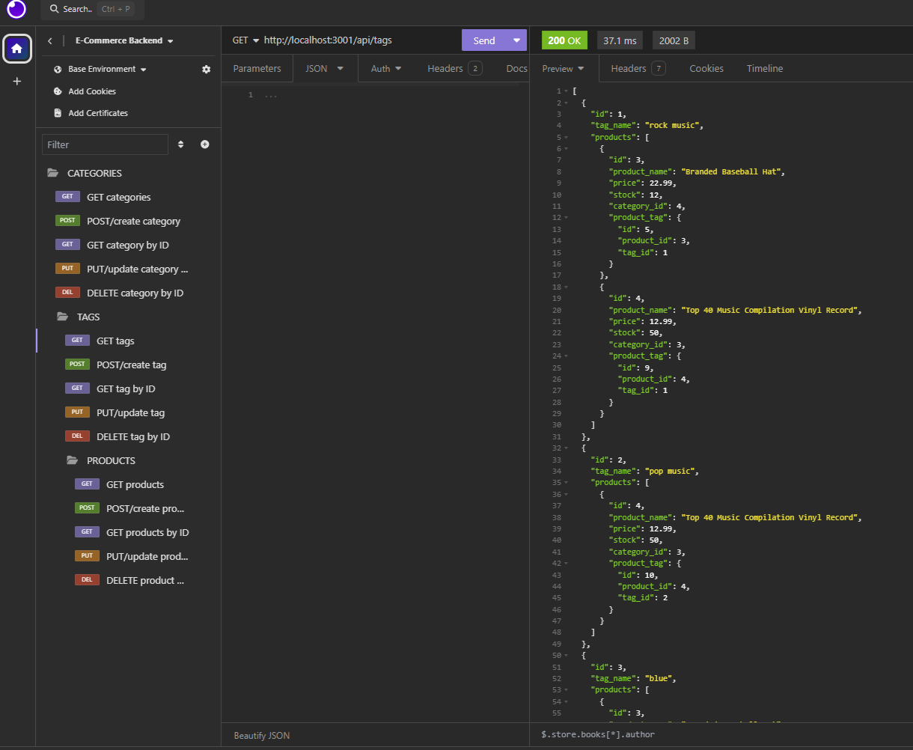
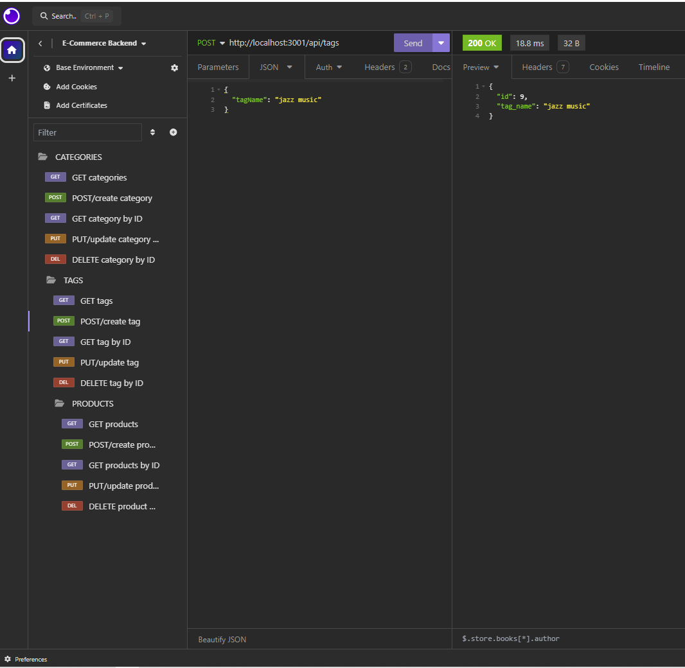
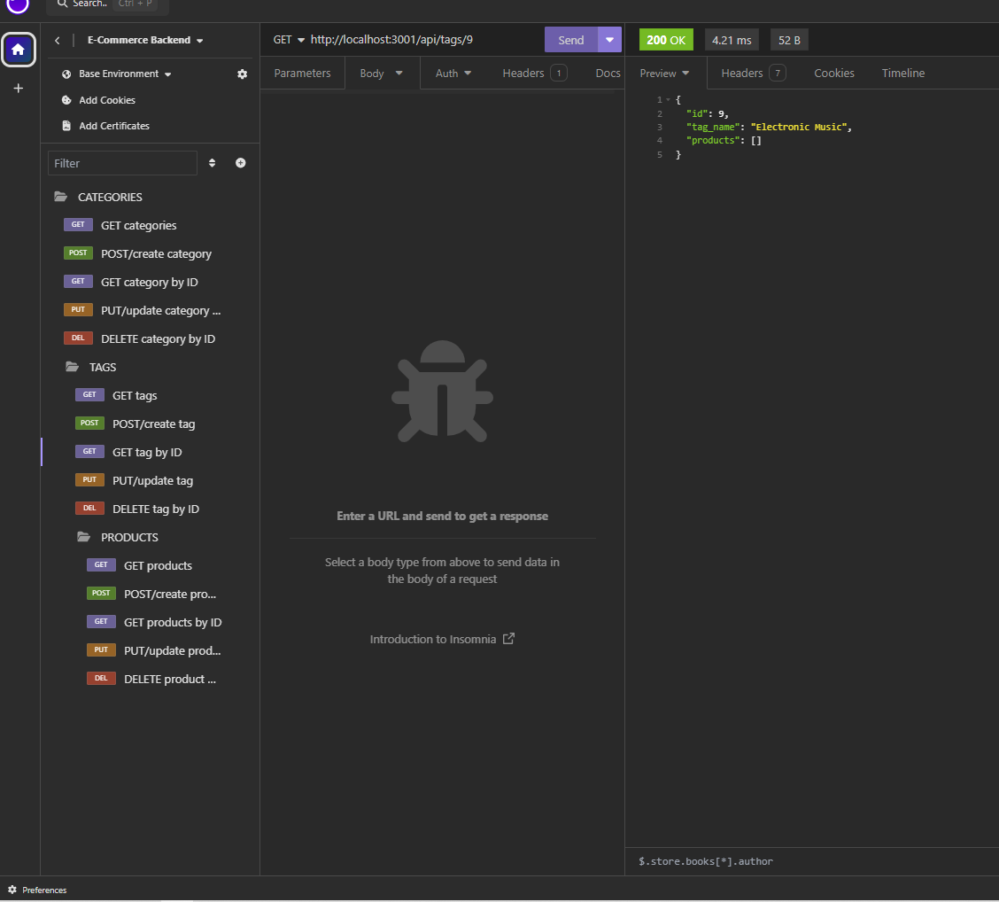
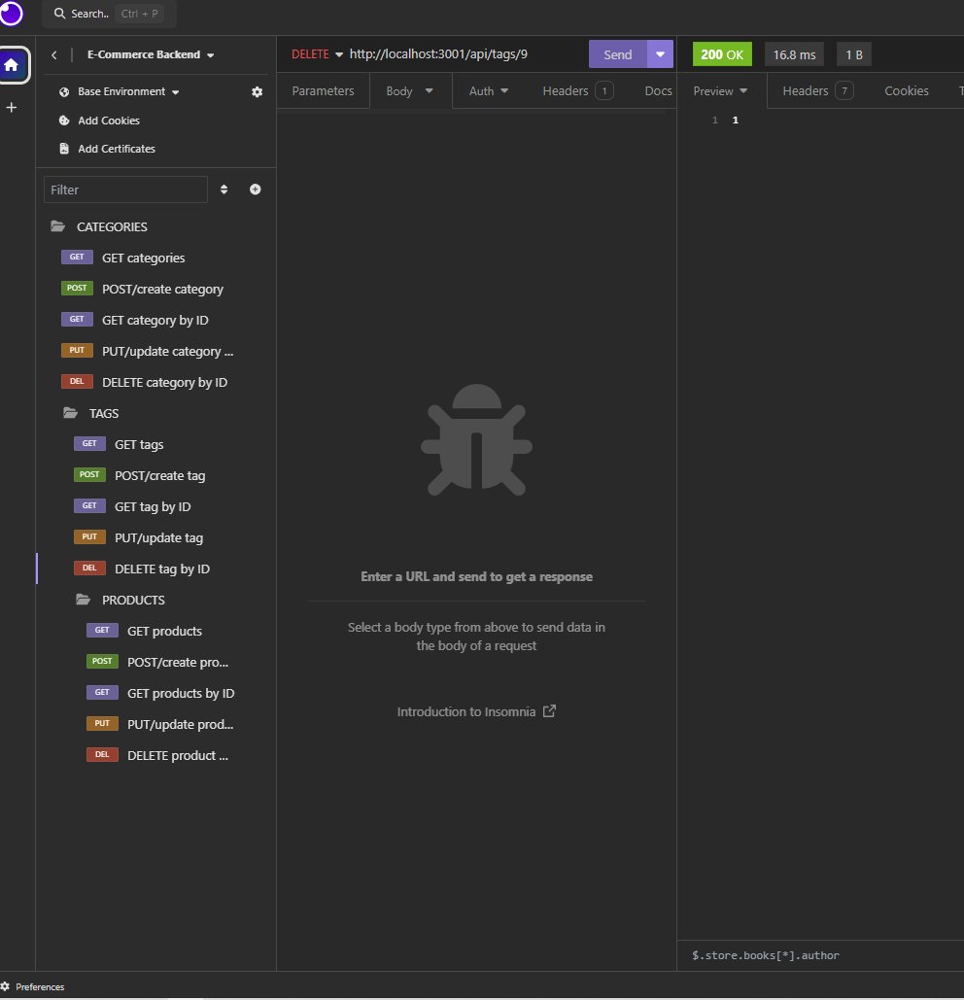
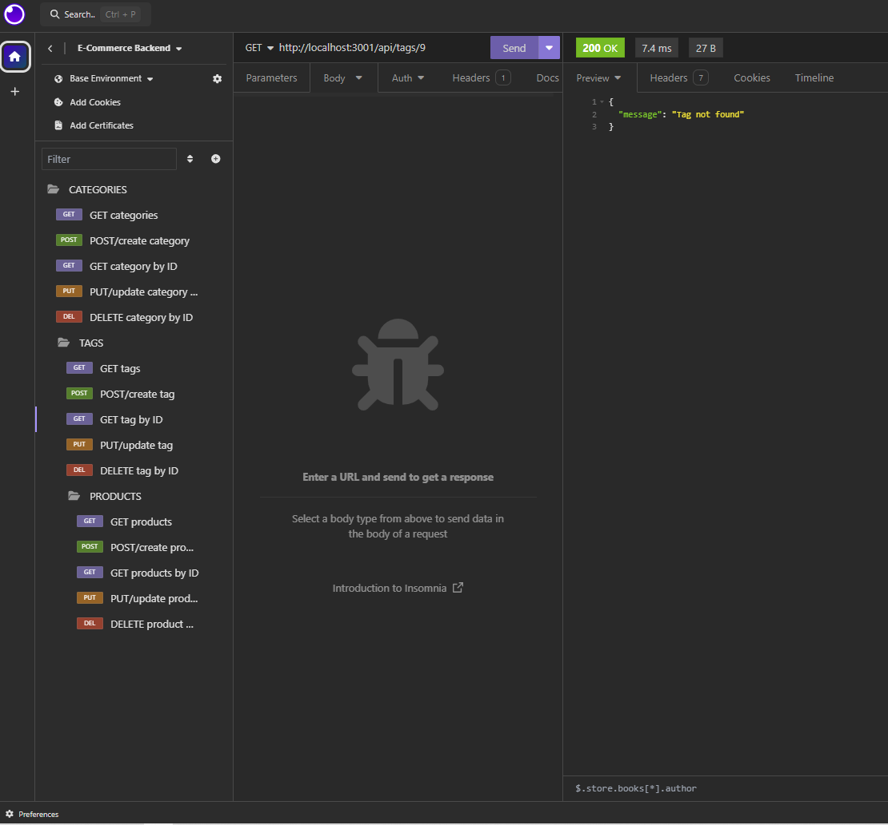

# E-Commerce Backend

## Description

For this application, given the starter code of a working Express.js API E-Commerce website, Sequelized was configured to use and interact with a MySQL database. The MySQL database includes tables for products, categories, tags, and product tags, in which requests and updates can be made through Sequelize queries.

## Table of Contents

* [Demo](#demo)
* [Installation](#installation)
* [Usage](#usage)
* [Technologies](#technologies)
* [Contact](#contact)

## Demo
View the full demo [here](https://drive.google.com/file/d/1UVmbFmFccEQw7S9XmtWLoUxceDBQDelg/view?usp=sharing)!

Example functionality:

GET all tags:

Create new tag:

Update tag:

Search id of tag to show that tag name was updated:

Delete tag by id:

Check that tag was deleted:

## Installation

* Clone repository to use this application on your local machine.
* Must have Node.js and MySQL installed to run the application. 
* Install necessary dependencies by navigating to the root directory and running `npm i`
* Create a file in the root directory titled `.env` and include database name and personal MySQL username and password.

## Usage

* Open MySQL using command `mysql -u root -p` and enter your MySQL password.
* Run `source db/schema.sql` to create database
* Seed database with `npm run seed`
* Start server with `npm start` command or, to start server with Nodemon, run `npm run watch`.
* Use [Insomnia](https://insomnia.rest/download) to interact through different routes.
* Having issues? Watch the [demo](https://drive.google.com/file/d/1aIqbkg0Giwn762jbxnFUW1A0CiEM5oGD/view?usp=sharing) to see the application in use. 

## Technologies

* [HTML](https://developer.mozilla.org/en-US/docs/Web/HTML)
* [CSS](https://developer.mozilla.org/en-US/docs/Web/CSS)
* [JavaScript](https://developer.mozilla.org/en-US/docs/Web/JavaScript)
* [Express.js](https://expressjs.com/)
* [Node.js](https://nodejs.org/en/)
* [Nodemon](https://www.npmjs.com/package/nodemon)
* [MySQL](https://www.mysql.com/)
* [dotenv](https://www.npmjs.com/package/dotenv)
* [Sequelize](https://sequelize.org/)

## Contact

Hi, my name is Samira Chetta! If you have any questions about this application or if you wish to contribute, I can be reached via email at samirachetta@gmail.com. Feel free to check out my other projects on my [github](https://github.com/samirayc)!

